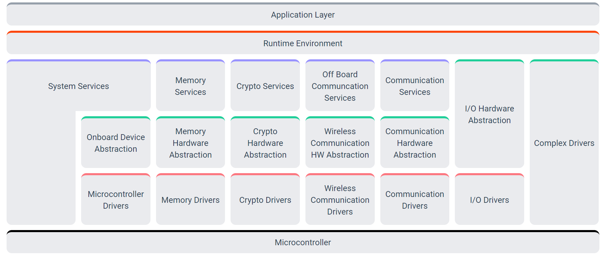

# IoT

## RTOS

* FreeRTOS
    * https://www.freertos.org/index.html
* ThreadX
    * https://github.com/azure-rtos/threadx

* RTOS文件系统对比：LittleFS Vs. SPIFFS
    * https://www.cnblogs.com/gmpy/p/12498999.html?utm_source=tuicool&utm_medium=referral
    * https://github.com/littlefs-project/littlefs

## 车联网

需要一个稳定的RTOS？AUTOSAR 或者ROS，或者其他

RTOS + Android等方便部署APP的OS

关键点？
* 稳定
    * ❤稳定的操作系统
    * 质量控制、认证？
    * ❤好的架构：低耦合、模块测试
* 自动/辅助 驾驶
    * 传感器：摄像头、雷达、红外等
    * ❤算法：传统算法、机械控制算法、路径规划算法
        * 确定性 vs. 不确定性
* 网路互联
    * 各种协议
        * 内部：CAN、PCI、I2C、WLAN、USB等
        * 外部：5G

发展点？
* ❤生态
    * 提供外部扩展能力
        * 扩展APP
        * 扩展传感器？
    * 安全 可信的运行环境
* 体验
    * UI UX
    * 智能

### AUTOSAR
https://www.autosar.org/standards/classic-platform/

[汽车开放系统架构（AUTOSAR）是什么](https://zhuanlan.zhihu.com/p/118849539)

## ROS

### ROS
* https://github.com/ros
* [链连接ROS和其他嵌入式系统](https://wiki.ros.org/rosserial)

### ROS2.0
* https://github.com/ros2
* [ROS进入2.0时代](https://www.bilibili.com/read/cv8152761/)

### micro-ROS
* https://github.com/micro-ROS
* [支持的RTOS](https://micro.ros.org/docs/overview/rtos/)

### TODO：
* 功能模块 与 仓库
* 搭建环境测试：Ubuntu & Raspberry & Arduino