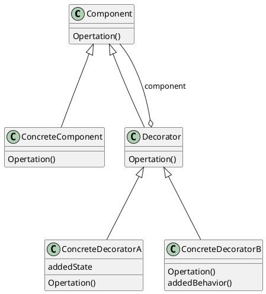
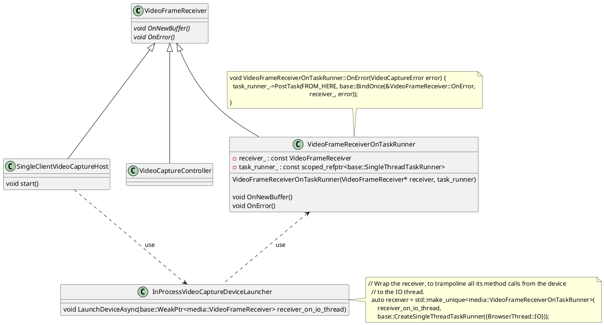

# 装饰者模式

## 是什么

动态的给一个对象添加一些额外的职责。就增加功能来说，装饰者模式相比生成子类更为灵活。

* Component
    * 定义一个对象接口，可以给这些对象动态的添加职责
* ConcreteComponent
    * 定义一个对象，可以给这个对象添加一些职责
* Decorator
    * 维持一个指向Component的指针，实现所有Decorator的通用功能
* ConcreteDecorator
    * 向组件添加职责

## 设计模式有哪些应用

* I/O Stream
    
* 图形库，为窗口组件添加装饰
    

## Chromium中的应用

Chromium中的VideoCapture功能有一部分实现是这样的：  
有一个VideoFrameReceiver的接口类，定义了一些Video事件处理接口（比如：新的Buffer，发生错误等）。  
有很多子类继承自VideoFrameReceiver，比如SingleClientVideoCaptureHost和VideoCaptureController。  
这两个子类在处理这些Video事件上有些不一样的需求，SingleClientVideoCaptureHost期望所有的Video事件处理都在I/O Thread，而VideoCaptureController没有这样的需求。  
于是定义了一个Decorator类VideoFrameReceiverOnTaskRunner，这个类会把所有Video事件的处理放在指定线程上。  
看看具体是怎么实现这个需求的：

当SingleClientVideoCaptureHost收到start请求后，调用InProcessVideoCaptureDeviceLauncher::LaunchDeviceAsync，并把自己的指针传进去。LaunchDeviceAsync中，创建Decorator对象VideoFrameReceiverOnTaskRunner，并传入SingleClientVideoCaptureHost的指针以及I/O Thread的TaskRunner。接着使用VideoFrameReceiverOnTaskRunner的对象，这样所有Video事件处理就会在I/O Thread中进行处理了。

## 如何遵循设计原则

1. 找出应用中可能需要变化之处，把它们独立出来，不要和那些不需要变化的代码混在一起。
    * ConcreteComponent和ConcreteDecorator独立
5. 类应该对扩展开放，对修改关闭
    * 开放：可以通过添加Decorator扩展功能。
    * 关闭：对ConcreteComponent的修改关闭。

## 注意事项

